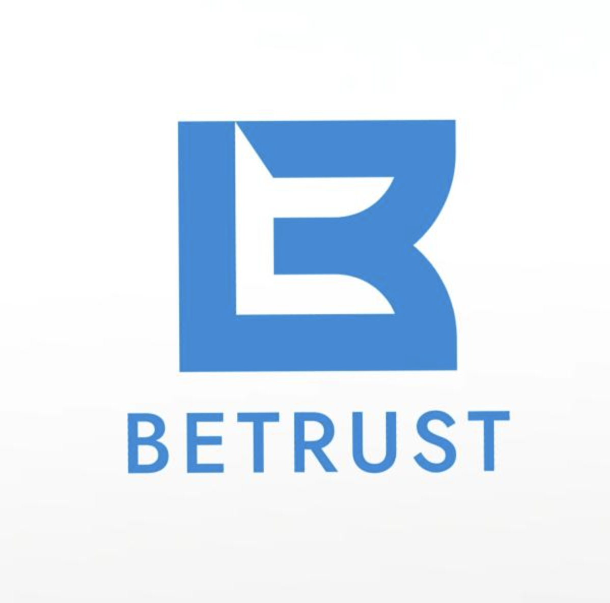

  
   
   
  <h1> BeTrust - Frontend</h1>

## **Installing the repo**

Clone the repo to a local folder.

`git clone https://github.com/BuenClima/betrust-frontend`

Enable corepack on the project.

`corepack enable`

CD into the folder and yarn to install dependencies through.

`yarn`

## **Environment Variables**

You will need various environment variables set to run the project. Ask another team member to send you these as save them in a file `.env` in the current folder. The `.env` is used on production and `.env.development` on development environment. A `.env.example` file is provided to fill it with the required variables.

## **Run the app**

To run the app locally

`yarn dev`
